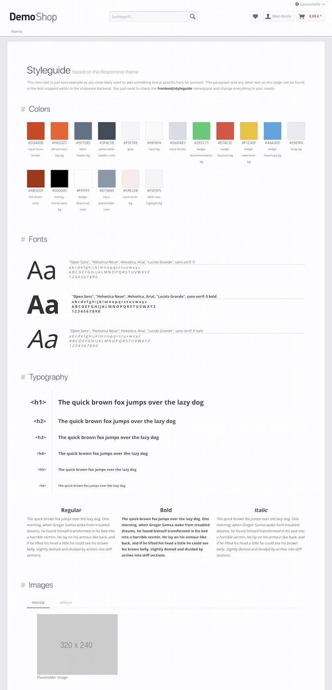
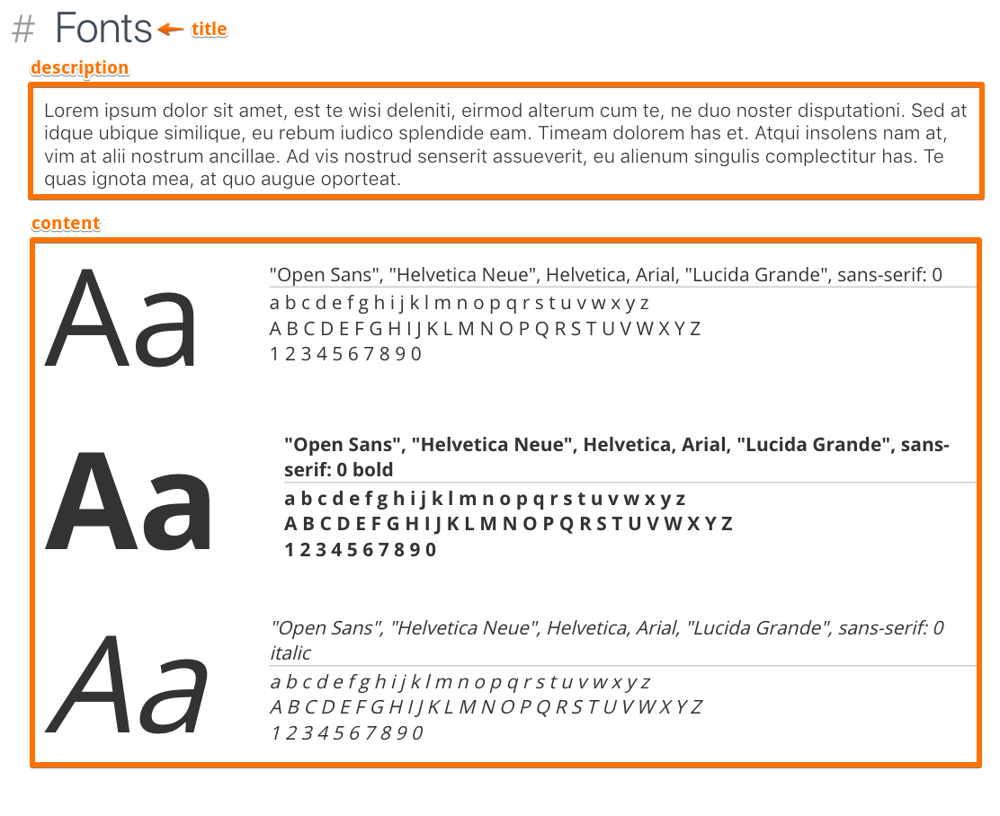
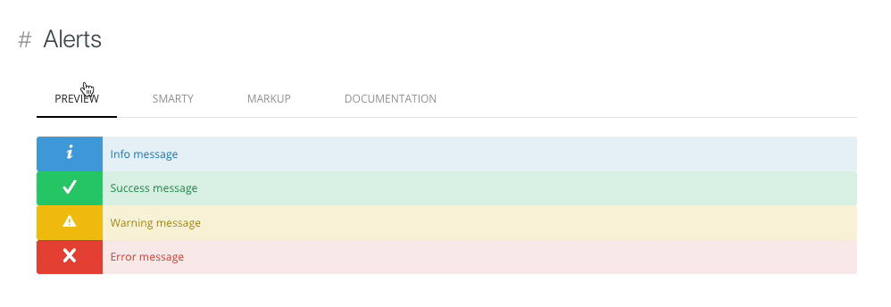

# Shopware Styleguide

[![Software License][license-image]][license-url]

Easily add a living styleguide for your [`shopware`](https://github.com/shopware/shopware) project

## Install

### Install using composer

This method requires shopware to be installed by composer as well. See this guide for details: [developers-guide/shopware-composer](https://developers.shopware.com/developers-guide/shopware-composer/)

```
composer require bezoerb/shopware-styleguide
```

### Alternative installation method

If you don't want to use composer you'll have to download the latest [release](https://github.com/bezoerb/shopware-styleguide/releases) and copy the files to `custom/plugins/Styleguide`.
This plugin can't be found at the shopware plugin registry yet.

## Getting started

After installing and activating this plugin you can reach the styleguide at the URL `http://my.shopoware.project.com/styleguide`

The plugin already tries to extract some basic information about your theme like colors, and fonts from the theme configuration.
If you your theme extends the shopware responsive theme the page should look something like this:



## File structure

### Styleguide components

This plugin will pick up all files provided in `THEME/frontend/_includes/styleguide/**/*.tpl`<br>
It also hijacks the `{$sMainCategories}` template assign to add a menu entry for each folder inside `THEME/frontend/\_includes/styleguide/`

Every file inside these folders should represent one section in your styleguide.

Example:

```
{extends file="frontend/styleguide/section.tpl"}

{block name="frontend_styleguide_section_title"}
  Fonts
{/block}

{block name="frontend_styleguide_section_description"}
  Lorem ipsum ...
{/block}

{block name="frontend_styleguide_section_content"}
  Main content...
{/block}
```



## Smarty helpers

This Plugin includes some helpers and templates to help you get started.

### styleguide_html

**Usage:** `{styleguide_html} ... {/styleguide_html}`

Place any markup in between and you'll get a preview.<br/> You can add a HTML comment at the beginning to provide some documentation (markdown supported).



### styleguide_function

**Usage:** `{styleguide_function name="..." arguments=[...]}`

**Params:**

- **name**: Name of the smarty function
- **arguments**: Assoc array or array of assoc arrays with function arguments. Use an array of argument arrays to show different variations of your function result.

### styleguide_include

**Usage:** `{styleguide_include file="..." arguments=[...]}`

**Params:**

- **file**: Filename
- **arguments**: Assoc array or array of assoc arrays with variables passed to the included file. Use an array of argument arrays to show different variations of your component.

## License

The MIT License (MIT). Please see [License File](LICENSE) for more information.

© Ben Zörb

[license-url]: LICENSE
[license-image]: https://img.shields.io/badge/license-MIT-brightgreen.svg
