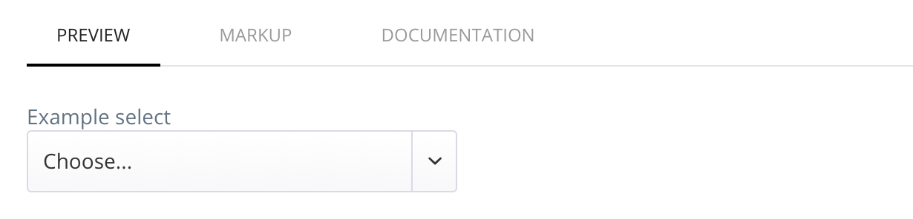

# Shopware Styleguide

[![Software License][license-image]][license-url] 

Easily add a living styleguide for your [`shopware`](https://github.com/shopware/shopware) project

## Getting started

After installing this plugin the you can reach the styleguide at  **/styleguide**

## File structure

This plugin will pick up all files provided in `THEME/frontend/_includes/styleguide/**/*.tpl` 
Every files should represent one section/component in your styleguide. 

Example:

```
{extends file="frontend/styleguide/section.tpl"}

{block name="frontend_styleguide_section_title"}
  Typography
{/block}

{block name="frontend_styleguide_section_description"}
  Lorem ipsum ...
{/block}

{block name="frontend_styleguide_section_content"}
	Main content... 
{/block}
```


## Smarty helpers
This Plugin includes some helpers and templates to help you get started.

### styleguide_html
**Usage:** `{styleguide_html} ... {/styleguide_html}`

Place any markup in between and you'll get a preview.<br/> You can add a HTML comment at the beginning to provide some documentation (markdown supported). 



### styleguide_function
**Usage:** `{styleguide_function name="..." arguments=[...]}`

**Params:** 

- **name**: Name of the smarty function
- **arguments**: Assoc array or array of assoc arrays with function arguments. Use an array of argument arrays to show different variations of your function result.

### styleguide_include
**Usage:** `{styleguide_include file="..." arguments=[...]}`

**Params:** 

- **file**: Filename
- **arguments**: Assoc array or array of assoc arrays with variables passed to the included file. Use an array of argument arrays to show different variations of your component.


## License

The MIT License (MIT). Please see [License File](LICENSE) for more information.

© Ben Zörb

[license-url]: LICENSE
[license-image]: https://img.shields.io/badge/license-MIT-brightgreen.svg
